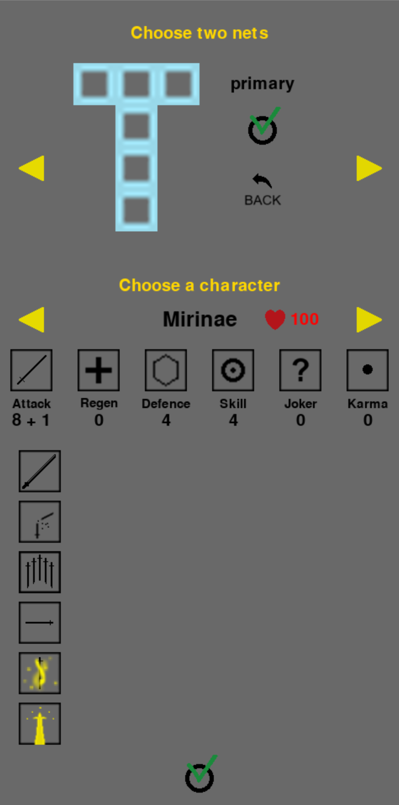
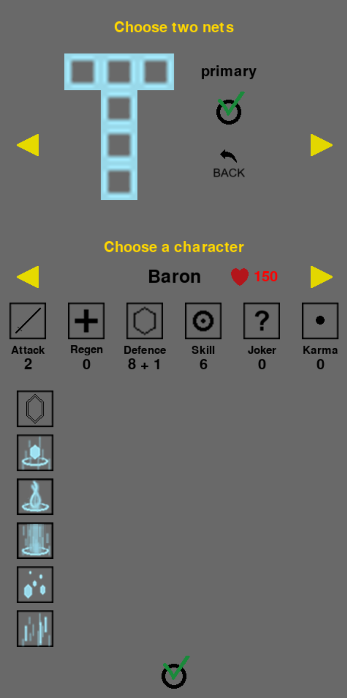
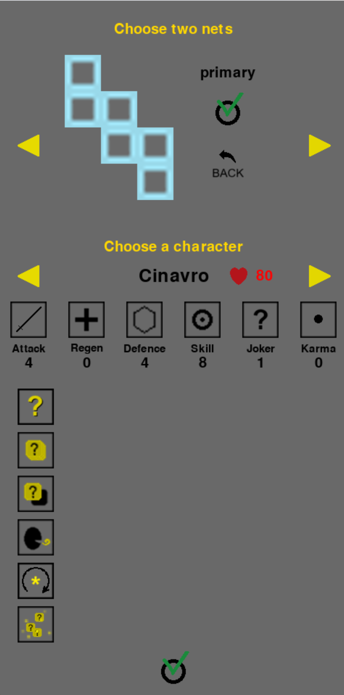
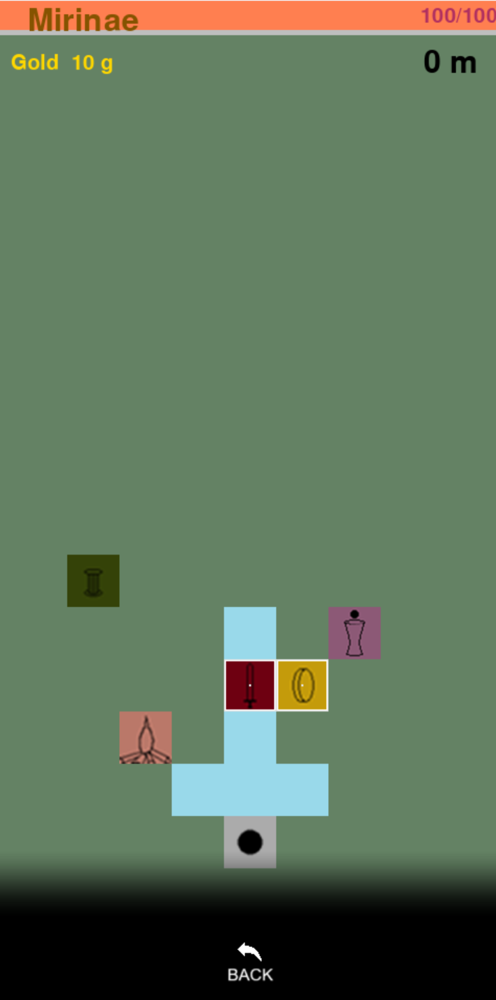
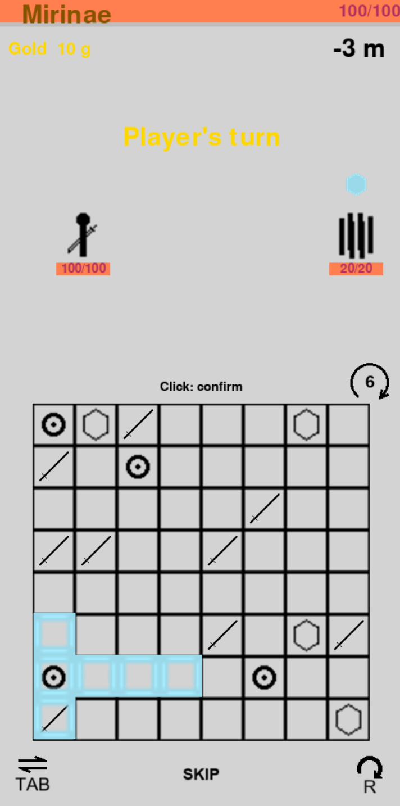
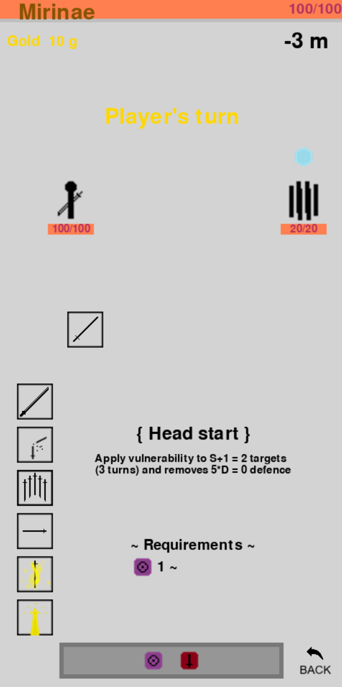
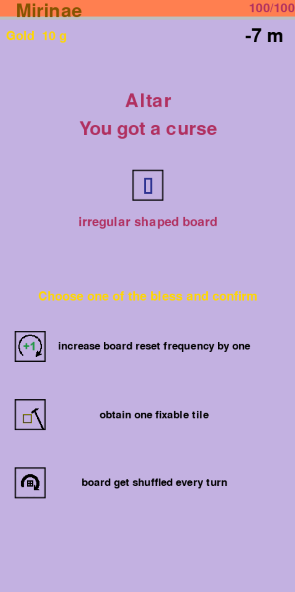
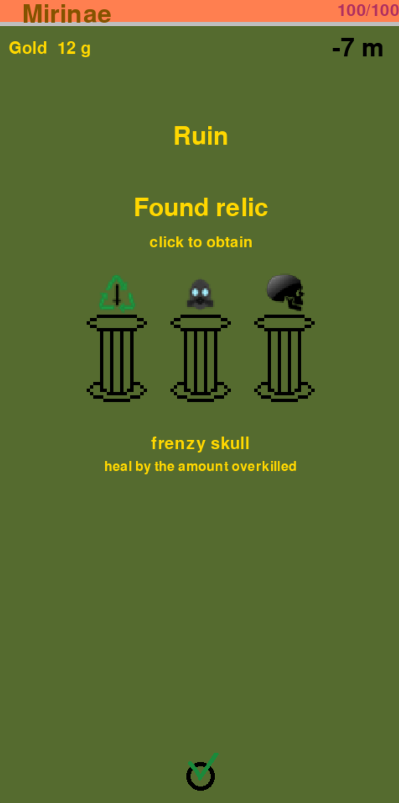
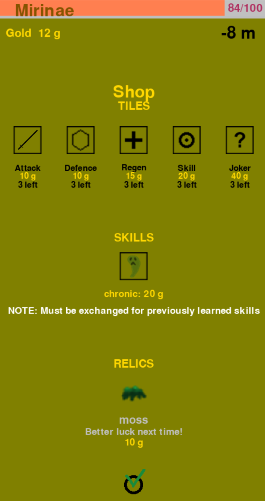

# Diagramiz
A simple dice game (actually a planar figure game)

# How to run
* Suggest IDE(like pyCharm) to play this game.

1. Download the latest 'tag' file and unzip it in your interpreter. If you use pyCharm, then put the file in PycharmProjects folder
2. (If using Pycharm) Go to interpreter settings and configure python interpreter ** to python version 3.8 or higher
3. Install pygame to the interpreter (version higher than pygame 2.6.0 is fine) using pip or using pycharm interpreter settings
4. Similarly to 3, install numpy version 2.0.1 or higher
5. Open the project folder (dice_game_test)
6. Run main.py 

** If 'Invalid Python interpreter selected ...' message comes out, click on 'Configure Python interpreter' and add one! Any interpreter of Python version greater or equal to 3.8 is ok.

## Sample run

                      

#
#
#
#
#
#
#
#
#
#
#
#
#
#

# Youtube test play
https://www.youtube.com/watch?v=I6kSO1ByNRE

# history
2024.07.21 Create basics

2024.07.22 Added buffs / multi enemy / skill mechaniques

2024.07.23 Added skill GUI (can use skills more easier) / Added areas (store, campfire, ruin, altar) / Added map adventure

2024.07.24 Completed map logic / Implement Joker => player gets to right-click it and choose one from the shown list above => then joker changes into it

2024.07.25 Added immediate attacking feature / Reworked Mirinae's skill / Now the game is rogue-like! 

2024.07.26 (Altar) Shrinkable board / width, height are now possible to change / possible to add/delete a tile permanently into the board

2024.07.28 Board is now implemented using indirection (can freely change board shape/configuration) / (Altar) Added fixing tile functionality to the board: player can choose one tile to be fixed in a location (still preserves location when shrinking - except on right most ones... they will be pulled in )

2024.07.29 - (Big update) change skill mechanism: you can learn/dis-learn random new skill in the shop (about 10 ~ 30 gold based on the power balance) 
/ you can have upto 6 skills maximum, so you have to dis-learn in order to learn new skills

2024.07.30 Altar, Shop, Campfire area now works / changed board tile's shape => [location, name, Boolean] where boolean indicates whether it is a fixed tile or not

2024.07.31 Make main menu: character selection(cannot change once fixed) / planar figure selection - make system + separate planar figure class from the board (for efficient drawing) / Implement altar completely: tile swap bless(?)

2024.08.01 Ruin area now works (+relics!) / Boss(halo) clear ending credit! / more UI: hover mouse over buffs(when fight) to see effects of each buffs / on enemy's show next move: what the mark means (it will {attack/defend/regen/buff/???} next turn etc.) / hover over enemy to see their name / added thorny enemy / Shop: Add a common relic for the shop! / when player wins a fight, show what the player earned from that combat (gold / tiles / relics etc.)

2024.08.02 add summoning type enemy / add tile adding enemy / hover over mini tiles to see their names and descriptions / Added slime tile / bosses spawn past -100, -150 (ruin boss), -200 and at LIMIT

2024.08.03 spike tile: if current tile contains spike tile, player gets 5 damage (deleted when board resets) / self duplicating tiles (like Karma/Proliferation tiles) / Proliferation tile: when not eliminated until the board refresh, you get (# of proliferation tile) * 5 damage
- limit number of relics to 24

2024.08.04 Fixed pathfinder logic -> DFS / Map generation logic: randomize location of adventure/shop/campfire/fight/ruin tiles / Added more enemies 

2024.08.05 enemy deploying logic: enemy combination/amount/poser changes as depth gets higher

2024.08.06 game balancing / add some Mirinae & Baron relics / ruin design change / map design change

2024.08.07 Mirinae skill rework (guard attack) / Added relics / add Cinavro skills 

2024.08.08 add poison learnable skills etc. / Baron skill framework done!

2024.08.9 add Baron skills

2024.08.11 Testing & Bug fix (Final update) + Baron balancing / added bless: board reset count increasing bless (good for baron maybe)

2024.08.22 Added new enemy: urchin, parasite 

2024.08.25 Smaller window size available

2024.08.26 Added Title screen / Make detailed description of enemy when mouse hover

2024.08.27 Added depth preview / Now you can place the planar figure in any location as long as it is connected to the base tile
/ More musics / fight end more smooth 

2024.08.28 Added skill masks / help screen: show some basic rules  / enhanced toggle buttons / bug fix: solved the issue of not being able to turn used tile to shaded tile after using it (CINAVRO) 

2024.08.29 Added how to fight in help_screen / Added Myth relics: black cube, yellow cube, red cube / (New map tile) black market: you can sell relics & buy powerful relics (TBU) / Added new mobs: Wall, Ikarus 

2024.08.30 Game saver & loader / Blue cube: max incoming damage fixed / Baron, Cinavro design / Apostle: deal damage proportional to player current health

2024.08.31 Add final boss: Nalo / Added relic: rapier

2024.09.02 Enemies drop more gold on fight, less gold on ruins / shop now sells common, rare, and epic relics!

2024.09.03 Added transition screen / Silent shield doubled / Bug fix 

# Future 
- Advanced path finder
브릿지인 타일 가는 도중에 다른 보이드 아닌 타일이 있는 경우 그걸 재외하고 차일드 만드는걸 먼저 돌려보기
그랬을때 패스가 안나온다면 이전꺼 돌려서 가는걸로

### beyond beta version (further implementation will use Flutter instead of python)
- Campfire: you can remove one tile from the board (if you want)

- Halo phase 2: NALO

- simple hit animation

- (better graphics) add health bar object that saves target value and have a shrinking animation at every update (call update instead of directly changing self.hp and drawing health bar)

- New debuff 'chained': (for player only) block the use of a specific tile for one turn => ruin mobs will use these

- Easy, normal, hard, hardcore mode (each start with 20 ruin choices + 3 free bless, 10 choices + 1 free bless, 3 choices + 1 free bless, 0 choices): of course I suggest hardcore

- options screen: see player information etc.

- Mirinae buff: Fix dagger/straw mat mechanism -> Also include tiles that are consumed (e.g. Excaliber skill)

# Character Concepts
Attack, defence, regeneration values are exponentially proportional to the number of tiles used, so it is important to use proper tiles.

### Mirinae the slayer
"Attack is the best defence"

A deck that focuses on attack rather than defense and recovery. 
She has an ultimate ability that allows her to collect a lot of attack tiles and inflict great damage, making it advantageous against strong enemies. Vulnerability can provide synergy.
A martial art skill can withstand situations with few attack tiles. 
In addition, it has wide-area and counterattacks, so it can stably deal with multiple enemies. 
Overall, she is specialized on focusing attack on one enemy.

### Cinavro the gambler
"It's not manipulation, it's my skills"

A deck that exploits 'Joker' tiles that can be used as any tiles you want. 
This makes the game easy, but his skill values are weak compared to other characters.
Hence it is essential to learn powerful skills bought in the shop.

### Baron the knight
"Protection, Protection, ... Protection"

A deck that is focused on building defence to negate any incoming damage. 
He is specialized on crushing multiple enemies at once due to his fissure skill etc.
The more defence gained, the stronger he gets.

### Narin the conservator of Karma
TBU (To Be Updated)

Karma, a substance that replicates itself, is a tile that returns as harm to you when the board is reset.
Hence you must either wait for Karma to duplicate and use them all or must eliminate from the beginning.
Use various skills to explore the synergy! The most fun deck.

### Riri the cleric
TBU 

### Arisu the explorer
TBU 

### Ato the noble
TBU 

# Music Credits
### Dove syndrome

sanctuary: EN_OKAWA

YOIYAMI: keyta

情動カタルシス: まんぼう二等兵

Morning: しゃろう

answer: KK  

Summer Wind

極東の羊、テレキャスターと踊る:しゃろう

Ending credit: パステルハウス

Tutorial: Forest of summer

Boss theme: Will you still cry?

Anxiety: ハルシオン

Trick style

Aquatic: カナリアスキップ

# About distribution
You are free to download and play the game, but you should not modify and re-distribute the game file. 

This game is planned for commercial use, so copying the game logic is prohibited.

All the assets except musics belong to the creator.